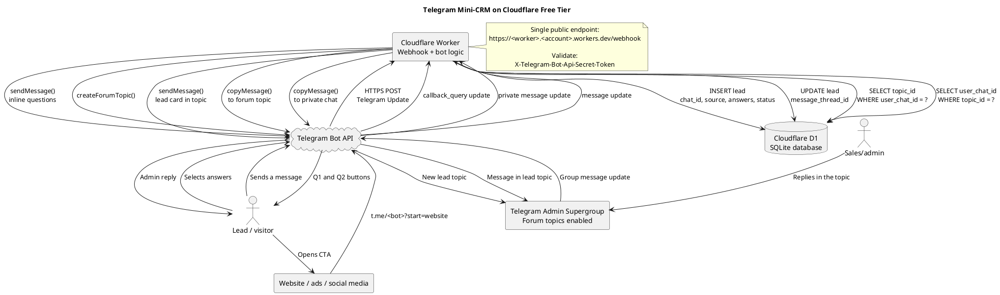

# tgcrm

# TODO
Yes — for the mini-CRM in the article, you can replace **both Yandex Cloud Functions and Object Storage** with a Cloudflare Worker plus Cloudflare D1 and stay comfortably within the Cloudflare free tier for the article’s intended scale (roughly 0–20 leads/month). The Worker can be the public Telegram webhook endpoint directly, so the Yandex Cloud → Cloudflare forwarding layer disappears. [habr](https://habr.com/ru/articles/1014876/)

The important design choice is: use **D1**, not KV, for lead/topic mappings. D1 gives you transactional SQL storage and a free allowance of 100,000 rows written and 5 million rows read per day; KV’s free tier has only 1,000 writes per day and is eventually consistent, which is less suitable as the system of record for a bidirectional chat relay. [developers.cloudflare](https://developers.cloudflare.com/workers/platform/pricing/)

## Proposed architecture

```text
Website / LinkedIn / ads
          │
          │ t.me/your_bot?start=website
          ▼
     Telegram Bot
          │
          │ HTTPS webhook POST
          ▼
Cloudflare Worker
  ├─ validates Telegram secret token
  ├─ handles /start and inline callbacks
  ├─ calls Telegram Bot API
  ├─ creates Telegram forum topics
  ├─ relays messages in both directions
  └─ reads/writes lead state
          │
          ▼
   Cloudflare D1 (SQLite)
  ├─ leads
  ├─ chat_id → topic_id mapping
  ├─ topic_id → chat_id mapping
  └─ optional qualification state
          │
          ▼
Telegram admin supergroup
  └─ Forum topic per lead
```

The user still interacts only with Telegram. You still get one topic per lead in an admin supergroup, with the same two-way relay model as in the article: customer → bot → lead topic, and your reply in the topic → bot → customer. [habr](https://habr.com/ru/articles/1014876/)

## PlantUML diagram

This version is intentionally simpler than the earlier Yandex Cloud + Worker proxy diagram:



## What goes into D1

The article uses Object Storage primarily for mappings such as `chat_id ↔ topic_id` and, optionally, transient state for “Other” answers. A small relational table is cleaner in D1.

```sql
CREATE TABLE leads (
  id INTEGER PRIMARY KEY AUTOINCREMENT,

  user_chat_id TEXT NOT NULL UNIQUE,
  telegram_user_id TEXT,
  username TEXT,
  first_name TEXT,
  last_name TEXT,

  source TEXT,
  business_type TEXT,
  request_type TEXT,

  topic_id INTEGER UNIQUE,
  status TEXT NOT NULL DEFAULT 'new',

  created_at TEXT NOT NULL DEFAULT CURRENT_TIMESTAMP,
  updated_at TEXT NOT NULL DEFAULT CURRENT_TIMESTAMP
);

CREATE INDEX idx_leads_topic_id
ON leads(topic_id);
```

You only really need two lookup patterns during relay:

```sql
-- Customer → admin topic
SELECT topic_id
FROM leads
WHERE user_chat_id = ?;

-- Admin topic → customer
SELECT user_chat_id
FROM leads
WHERE topic_id = ?;
```

For `/start` and inline buttons, you can preserve the article’s stateless technique:

```text
q1:ecommerce
q2:agent:ecommerce
```

That means you do **not** need to write qualification state for the normal two-question path. Store a row only when the lead is finalized and the forum topic is created. If you add free-text “Other,” use a small `lead_drafts` table or a `status = 'qualifying'` row in `leads`.

## Free-tier fit

For the stated use case, the free plan is much more than enough.

| Resource | Cloudflare free allowance | Expected mini-CRM usage | Assessment |
|---|---:|---:|---|
| Worker requests | 100,000 per day | Each Telegram update invokes the Worker once | Safe for a small lead bot.  [developers.cloudflare](https://developers.cloudflare.com/workers/platform/limits/) |
| D1 reads | 5 million rows per day | Usually 1–2 indexed reads per relayed message | Far beyond this use case.  [developers.cloudflare](https://developers.cloudflare.com/workers/platform/pricing/) |
| D1 writes | 100,000 rows per day | New lead, topic mapping, optional status changes | Far beyond this use case.  [developers.cloudflare](https://developers.cloudflare.com/workers/platform/pricing/) |
| D1 storage | 5 GB total | A few database rows per lead | Effectively negligible.  [developers.cloudflare](https://developers.cloudflare.com/workers/platform/pricing/) |
| D1 databases | 10 per account | One is sufficient | Safe.  [developers.cloudflare](https://developers.cloudflare.com/d1/platform/limits/) |

For perspective, even if one complete lead interaction caused 100 Telegram updates, 20 leads per month would mean only around 2,000 Worker requests per month—well below the daily Worker allowance, before considering ordinary reply traffic.

## Important implementation constraints

### Keep the webhook handler short

Telegram expects your webhook endpoint to return success promptly. Your Worker should:

1. Verify the secret header.
2. Parse the update.
3. Process `/start`, `callback_query`, or `message`.
4. Call Telegram’s Bot API using `fetch()`.
5. Return `200 OK`.

Do not put slow LLM calls, document parsing, email scraping, or CV analysis directly in the synchronous webhook path. For the CRM described in the article, the worker performs only lightweight routing, D1 queries, and Telegram API calls—well aligned with Workers.

### Protect the endpoint

Set a random `secret_token` when registering the Telegram webhook. Telegram will include it in `X-Telegram-Bot-Api-Secret-Token`; the Worker must compare it with a Worker secret before accepting the update. This preserves the article’s security model. [habr](https://habr.com/ru/articles/1014876/)

Store these as Cloudflare Worker secrets, not in source code:

```bash
wrangler secret put BOT_TOKEN
wrangler secret put TELEGRAM_WEBHOOK_SECRET
wrangler secret put ADMIN_GROUP_ID
wrangler secret put ADMIN_USER_ID
```

### Handle duplicate webhook deliveries

Telegram may retry when it does not receive a successful response. The article’s “one topic per user” requirement means you should make finalization idempotent:

- `user_chat_id` must be `UNIQUE`.
- Before `createForumTopic`, query whether `topic_id` already exists.
- After creating the topic, persist its ID immediately.
- For stronger protection against concurrent duplicate callbacks, use a D1 transaction or an atomic state change such as `status: qualifying → creating → active`.

A simple practical rule:

```text
If a lead already has topic_id:
  do not create another topic;
  send the “you already submitted a request” response.
```

### Workers free CPU time

The free Workers plan has limited CPU per invocation, so use the Worker as an orchestration layer—not as a Python-like heavyweight runtime. A compact TypeScript Worker with native `fetch()`, D1 binding, and no large dependencies is ideal. The Worker request limit is 100,000/day; the bot itself will normally hit neither request nor D1 quotas at a small-team lead volume. [developers.cloudflare](https://developers.cloudflare.com/workers/platform/pricing/)

## Recommended stack

```text
Cloudflare Worker       TypeScript, webhook and Telegram API wrapper
Cloudflare D1           Lead records, chat/topic mappings, status
Telegram Bot API        Bot interface and forum-topic CRM UI
Cloudflare Workers URL  Public HTTPS webhook endpoint
Optional Cloudflare Queues
                        Later: slow CV parsing, LLM summaries,
                        email notifications, retryable background work
```

You do **not** need Cloudflare KV, R2, Pages, a custom domain, or Yandex Cloud for the baseline CRM. Start with Worker + D1 only. Add R2 later if people upload CV PDFs and you explicitly want to retain copies outside Telegram; otherwise Telegram’s message history and `file_id` may be enough for the initial version.

## Bottom line

A Cloudflare-only implementation is not merely possible—it is cleaner for your connectivity constraint:

- One public webhook endpoint instead of Worker → Yandex Function forwarding.
- One coherent control plane for code, environment secrets, logs, and data.
- D1 is a better match than S3-style JSON files for lead and thread mappings.
- The free tier comfortably supports a Telegram mini-CRM for a solo founder or small recruiting/sales workflow. [habr](https://habr.com/ru/articles/1014876/)

The main caveat is not quota but scope: retain the Worker for fast webhook processing, and move heavyweight CV extraction, LLM scoring, or external API enrichment to an asynchronous design if you add those capabilities later.
